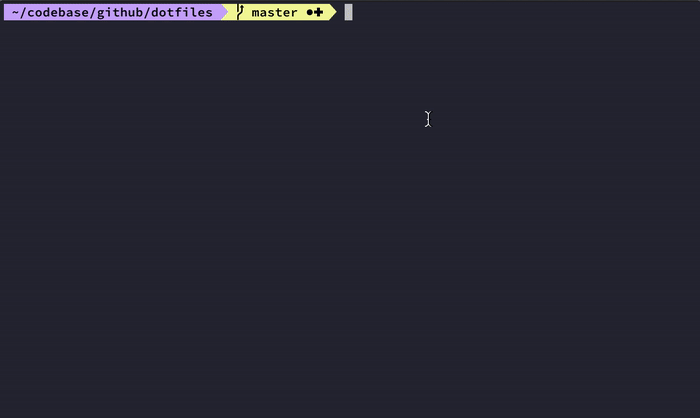
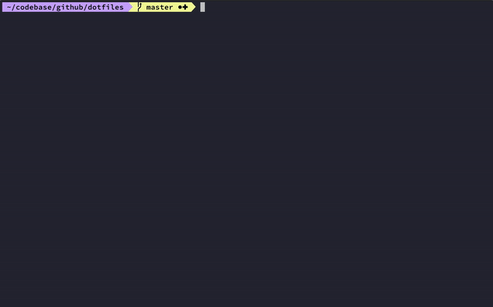

# dotfiles
A curated list of `dotfiles` I use for my local development environment.


## What is it?
This repository intended to consolidate commonly used .dotfiles to a single place.<br/>
It creates symlinks from [dotfiles directory](dotfiles/managed) to your home directory.<br/>
Additionally, this repository contains:
- [Homebrew](https://github.com/Homebrew/brew) installation script for common [packages and casks](brew/brew.sh) that I use
- macOS custom KeyBindings, Finder customizations and keyboard preferences

## Getting Started

List of available `make` commands:

1. `install`   - create symlinks from this repo to $HOME directory
2. `uninstall` - remove all symlinks from $HOME directory
3. `brew`      - (optional) install commonly used Homebrew [packages and casks](brew/brew.sh)
4. `mac`       - (optional) install macOS KeyBindings, setup finder customizations and keyboard preferences
5. `all`       - (optional) execute `install`, `brew` and `mac` in this order
6. `help`      - (optional) get available actions

## Customization

Set `DOT_FILES_REPO` and other custom paths as env vars in the `dotfiles/files/.exports` file, should look something like this:
```bash
export CODEBASE=${HOME}/codebase
export ENVIRONMENT=${HOME}/environment

export DOT_FILES_REPO=${CODEBASE}/github/dotfiles
export DOCKER_FILES=${CODEBASE}/github/dockerfiles
export TERRAFORM_FILES=${CODEBASE}/github/terraformfiles
```

### Transient Files
If files in `dotfiles/transient` directory exists, they will be sourced along but won't get symlink to $HOME directory.<br/>
You can use this to add commands you don’t want to commit to a public repository such as `.secrets` for example.

    .
    ├── ...
    ├── dotfiles               
    │   └── files              # dotfiles that are being symlink to $HOME directory and get sourced on new shell session
    │       └── ...            
    │   └── transient          # dotfiles that only gets sourced on new shell session
    │       ├── .extra       
    │       └── .secrets       
    │   └── .dotfiles.sh  # dotfiles install/uninstall management script 
    └── ...
                     
> It is not recommended to commit the .secret transient file as it may contain sensitive information

## Quick Start Guide

#### `make install`


#### `make brew`


#### `make mac`
