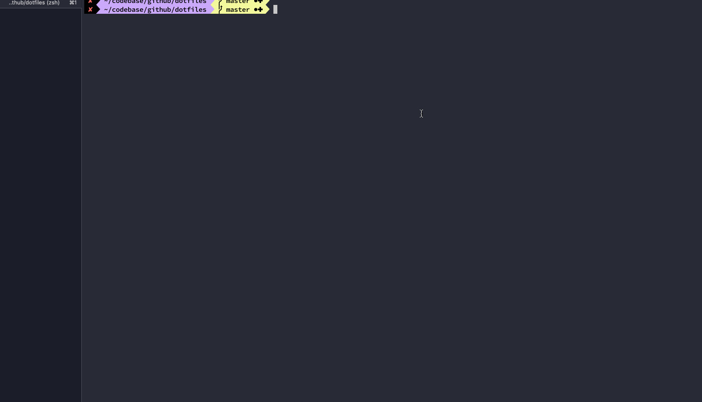

# dotfiles
A curated list of `dotfiles` I use for my local development environment.

## What is it?
This repository intended to consolidate and manage commonly used .dotfiles into a single place backed by a git repository. 
It creates symlinks from [dotfiles directory](dotfiles) in the following manner:

- `~/.dotfiles/.config` - directories paths of *dotfiles repo* and *.dotfiles symlinks* + reload symlinks function
- `~/.dotfiles/managed/*.*` - content to symlink across all machines
- `~/.dotfiles/custom/*.*` - content to symlink in specific machines e.g. work related / personal etc..

Additionally, this repository contains:
- [Homebrew](https://github.com/Homebrew/brew) installation script for common [packages and casks](brew) that I use
- macOS custom KeyBindings, Finder customizations and keyboard preferences

## Getting Started

List of available `make` commands:

1. `dotfiles`   - create/remove .dotfiles symlinks to/from this repo
1. `brew` - (*optional*) install commonly used Homebrew [packages and casks](brew/brew.sh)
1. `mac`  - (*optional*) install macOS KeyBindings, setup finder customizations and keyboard preferences
1. `all` - (*optional*) execute `mac`, `dotfiles` and `brew` in this order
1. `help` - (*optional*) get available actions

## Customization

<u>**Custom**</u>

Just add any custom dotfile to `<repo-root>/dotfiles/custom/*.*` and it'll be sources on every new shell.

**<u>Managed</u>**

If a managed content should be added, add it to the relevant file:

- `.aliases`
- `.functions`
- `.paths`

### Transient Files
If files in `<repo-root>/dotfiles/transient` directory exists, they will be sourced along but won't get symlinked anywhere. 
You can use this to export ENV vars with sensitive information such as secrets in an opened shell. Files under `transient` folder are git ignored by default to prevent from committing to a public repository.

| :warning: Warning |
| :--------------------------------------- |
| It is not recommended to commit the `.secret` transient file as it may contain sensitive information |

    .
    ├── ...
    ├── dotfiles               
    │   └── custom  # dotfiles to symlink in specific machines e.g. work related / personal etc..
    │       ├── .my-company  
    │       └── ...
    │   └── home  # files that should get symlinked in HOME folder
    │       ├── .gitignore_global       
    │       └── ...
    │   └── managed  # dotfiles to symlink across all machines
    │       ├── .aliases
    │       └── ...
    │   └── shell  # shell run commands to gets sourced on new shell session (+run command to load dotfiles)
    │       ├── .zshrc
    │       └── ...
    │   └── transient # content that gets sourced on new shell session but not symlinked
    │       └── .secrets       
    │   └── .dotfiles.sh  # dotfiles install/uninstall management script 
    └── ...

## Quick Start Guide

####  `make dotfiles` (install)

Show

 

#### `make dotfiles` (uninstall)

Show

 

#### `make brew` (install packages/casks)

Show

 

#### `make mac` (mac-os overrides)

Show

 
